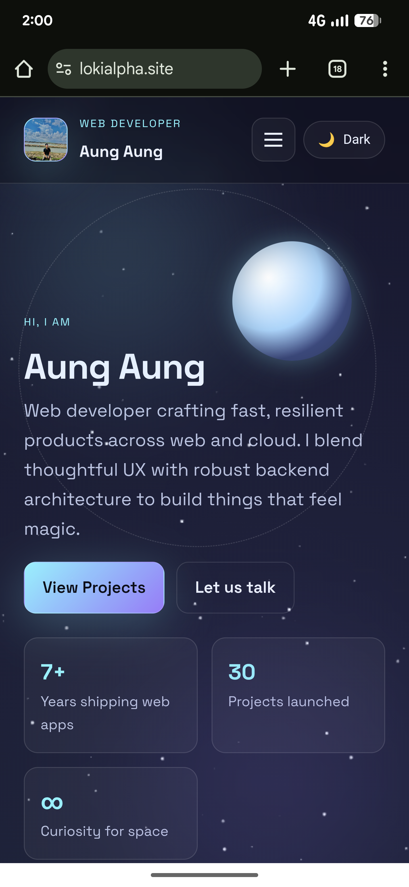

# My Portfolio 🌌

🌐 **Live Website:** https://lokialpha.site

Personal portfolio showcasing my web projects, automation tools, and digital products.  
Designed with a space-themed interface to highlight creativity, frontend skills, and real-world deployment.

---

## 📸 Preview



---

## 👋 About This Project

This portfolio serves as my main developer hub where I showcase:
- Real projects with live demos
- Web and automation skills
- Product-focused development mindset

It is built not just as a personal website, but as a **career portfolio** for clients, collaborators, and recruiters.

---

## ✨ Key Features

- 🌌 Space-themed UI with animated visuals
- 🎨 Dark / Light mode toggle
- 📂 Dedicated pages for projects and content
- ⚡ Fast loading and clean structure
- 🌍 Deployed with custom domain support

---

## 🛠 Tech Stack

- **Frontend:** HTML, CSS, JavaScript
- **Backend:** Python (lightweight local server)
- **Deployment:** GitHub Pages + Custom Domain
- **Tools:** Git, GitHub

---

## 📚 What I Learned

- Structuring a portfolio for real-world use
- Improving UI/UX through animations and layout
- Deploying with GitHub Pages and custom domains

---

## 🚀 Live Preview

👉 Visit the live site here:  
**https://lokialpha.site**

---

## 🧠 Why I Built This

This portfolio was built to:
- Centralize all my developer work in one place
- Demonstrate UI/UX and frontend fundamentals
- Experiment with animations and visual storytelling
- Act as a foundation for future projects and products

---

## ⚙️ Run Locally (Optional)

If you want to run the project locally:

1. Make sure **Python 3** is installed
2. From the project root, start the server:
   ```bash
   python3 app.py
